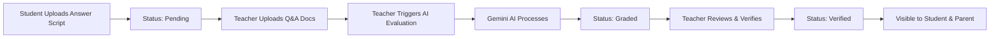

# 📚 Grade Master - AI Auto Grader System

## ✨ Overview

Grade Master is an **AI-powered answer script evaluation system** integrated into the ConnectBook platform. It uses **Google's Gemini AI** to automatically grade student answer scripts by comparing them with question papers and answer keys, providing detailed feedback and question-wise analysis.

---

## 🎯 Features

### For Students
- ✅ **Upload Answer Scripts** (PDF/DOCX format)
- ✅ **Track Submission Status** (Pending, Graded, Verified)
- ✅ **View Verified Results** with detailed breakdowns
- ✅ **Question-wise Marks** with AI feedback
- ✅ **Overall Performance Feedback** from AI
- ✅ **Key Highlights** identified by AI

### For Teachers
- ✅ **View All Student Submissions** from their department
- ✅ **Upload Question Paper & Answer Key**
- ✅ **Trigger AI Evaluation** with one click
- ✅ **Review AI Grading Results** with detailed analysis
- ✅ **Verify & Publish Results** to students and parents
- ✅ **Strengths & Areas for Improvement** identified by AI

### For Parents
- ✅ **View Verified Results** of linked student
- ✅ **Subject-wise Performance** tracking
- ✅ **Average Score Calculation**
- ✅ **Detailed Question-wise Breakdown**
- ✅ **Teacher's Feedback** visibility

---

## 🚀 Getting Started

### Prerequisites

1. **Gemini API Key**: Get your API key from [Google AI Studio](https://makersuite.google.com/app/apikey)

### Setup Instructions

1. **Add Gemini API Key to Backend .env**
   ```env
   # In backend/.env
   GEMINI_API_KEY=your_actual_gemini_api_key_here
   ```

2. **Restart Backend Server**
   ```bash
   cmd /c "cd backend && npm restart"
   ```

3. **Frontend Already Configured** ✅
   - All routes added to App.jsx
   - Navigation buttons added to dashboards
   - Components ready to use

---

## 📖 How to Use

### For Students

1. **Navigate to Grade Master**
   - From Student Dashboard → Click "Grade Master" card

2. **Submit Answer Script**
   - Select Subject from dropdown
   - Upload your answer script (PDF or DOCX)
   - Click "Submit for Grading"
   - Status: "Pending" → waiting for teacher evaluation

3. **View Results**
   - Once verified by teacher, status changes to "Verified"
   - Click on any verified result to see:
     - Total marks and percentage
     - Question-wise breakdown
     - AI feedback
     - Key highlights

### For Teachers

1. **Navigate to Grade Evaluator**
   - From Teacher Dashboard → Click "Grade Evaluator" card

2. **Select a Submission**
   - Browse student submissions on the left sidebar
   - Click on any submission to select it

3. **Upload Documents**
   - Upload Question Paper (PDF/DOCX)
   - Upload Answer Key (PDF/DOCX)
   - Click "Upload Documents"

4. **Start AI Evaluation**
   - Click "Start AI Evaluation" button
   - Wait for AI to process (may take 30-60 seconds)
   - Review AI-generated results:
     - Overall marks and percentage
     - Question-wise marks
     - Feedback for each question
     - Strengths & areas for improvement

5. **Verify & Publish**
   - Review the AI evaluation carefully
   - Click "Verify & Publish Results"
   - Results become visible to student and parent

### For Parents

1. **Navigate to Grade Viewer**
   - From Parent Dashboard → Click "Grade Reports" button

2. **View Results**
   - See all verified results in a table format
   - Statistics cards show:
     - Total subjects evaluated
     - Average score across all subjects
     - Number of verified results

3. **Detailed Report**
   - Click "View Details" on any result
   - See complete breakdown:
     - Overall score and percentage
     - Question-wise performance
     - Teacher's feedback
     - Key strengths identified

---

## 🔧 Technical Architecture

### Backend Components

#### Models
- **StudentSubmission.js**: Stores student answer script uploads
- **TeacherDocument.js**: Stores question papers and answer keys
- **Grade.js**: Stores AI-generated grades and feedback

#### Routes (`/api/grade`)
- `POST /upload-answer` - Student uploads answer script
- `POST /upload-teacher-docs` - Teacher uploads question paper & answer key
- `POST /evaluate/:submissionId` - Trigger AI evaluation
- `PATCH /verify/:submissionId` - Teacher verifies and publishes results
- `GET /student/submissions` - Get student's submissions
- `GET /student/results` - Get student's verified results
- `GET /teacher/submissions` - Get submissions for teacher's department
- `GET /parent/results/:usn` - Get linked student's verified results

#### Services
- **geminiGradingService.js**: 
  - Extracts text from PDF/DOCX files
  - Sends to Gemini AI for evaluation
  - Parses JSON response with marks, feedback, and highlights

### Frontend Components

- **GradeMaster.jsx** (Student): Upload and view results
- **GradeEvaluator.jsx** (Teacher): Evaluate and verify submissions
- **GradeViewer.jsx** (Parent): View verified results

### File Storage

- Answer Scripts: `backend/uploads/grade_master/answer_scripts/`
- Question Papers: `backend/uploads/grade_master/question_papers/`
- Answer Keys: `backend/uploads/grade_master/answer_keys/`

---

## 🤖 AI Evaluation Process

### How Gemini AI Grades Answers

1. **Text Extraction**
   - PDF files parsed using `pdf-parse`
   - DOCX files parsed using `mammoth`

2. **AI Prompt Engineering**
   ```
   - Question Paper Text
   - Answer Key (Model Answer)
   - Student's Answer
   
   AI analyzes:
   - Accuracy of concepts
   - Completeness of answer
   - Clarity of explanation
   - Relevant examples/formulas
   ```

3. **AI Response Format**
   ```json
   {
     "marks_per_question": [
       {
         "question_number": 1,
         "marks_obtained": 8,
         "max_marks": 10,
         "feedback": "Good understanding, missed one key point",
         "highlights": ["correct formula", "proper derivation"]
       }
     ],
     "total_marks_obtained": 42,
     "total_max_marks": 50,
     "percentage": 84,
     "overall_feedback": "Excellent work! Focus on Q3 concepts.",
     "highlighted_phrases": ["key concept 1", "key concept 2"],
     "strengths": ["Strong conceptual understanding", "Clear explanations"],
     "areas_for_improvement": ["Improve Q3 - missed formula", "Add more examples"]
   }
   ```

4. **Semantic Evaluation**
   - NOT just keyword matching
   - Understands conceptual similarity
   - Recognizes alternate valid explanations
   - Awards partial marks appropriately

---

## 🎨 UI Features

### Beautiful Animations
- Framer Motion for smooth transitions
- Card hover effects
- Loading spinners during AI evaluation
- Success animations on upload

### Color-Coded Status
- 🟡 **Pending**: Yellow badge
- 🔵 **Graded**: Blue badge (awaiting verification)
- 🟢 **Verified**: Green badge (published)

### Responsive Design
- Mobile-friendly layouts
- Dark mode support
- Gradient backgrounds
- Modern glassmorphism effects

---

## 📊 Sample Workflow



---

## ⚠️ Important Notes

### File Requirements
- **Formats Supported**: PDF, DOC, DOCX
- **Max File Size**: 10MB per file
- **Text-based PDFs**: Scanned images won't work (need OCR)

### API Rate Limits
- Gemini API has rate limits
- One evaluation may take 30-60 seconds
- Handle errors gracefully

### Data Privacy
- Answer scripts stored securely
- Only verified results visible to students/parents
- Teachers can only see their department's submissions

---

## 🐛 Troubleshooting

### Issue: "Failed to evaluate submission"
**Solution**: 
- Check if GEMINI_API_KEY is correctly set in backend/.env
- Ensure question paper, answer key, and answer script are uploaded
- Check if files are text-readable PDFs (not scanned images)

### Issue: "Failed to extract text from PDF"
**Solution**:
- Ensure PDF contains selectable text
- If scanned image, convert to text-PDF first
- Try DOCX format instead

### Issue: "Validation failed - missing fields"
**Solution**:
- Ensure all required fields are provided
- Check console logs for specific missing fields
- Verify file uploads completed successfully

---

## 🔮 Future Enhancements

- [ ] Support for scanned images (OCR integration)
- [ ] Bulk evaluation of multiple submissions
- [ ] Downloadable PDF reports
- [ ] Plagiarism detection
- [ ] Answer script comparison between students
- [ ] Analytics dashboard for teachers
- [ ] Email notifications on result publication

---

## 📞 Support

If you encounter any issues:
1. Check console logs (Browser DevTools → Console)
2. Check backend logs in terminal
3. Verify all environment variables are set
4. Ensure Gemini API key is valid

---

## ✅ Testing Checklist

- [ ] Student can upload answer script
- [ ] Teacher can see submission in list
- [ ] Teacher can upload question paper & answer key
- [ ] AI evaluation completes successfully
- [ ] Results show proper marks and feedback
- [ ] Teacher can verify and publish results
- [ ] Student sees verified results
- [ ] Parent sees verified results
- [ ] All status updates work correctly
- [ ] Error handling works for invalid files

---

## 🎉 Success!

Your Grade Master system is now fully integrated and ready to use! Students can submit answer scripts, teachers can evaluate using AI, and parents can monitor performance—all in one platform.

**Next Steps:**
1. Add your Gemini API key to backend/.env
2. Restart the backend server
3. Test the complete workflow
4. Enjoy AI-powered grading! 🚀
